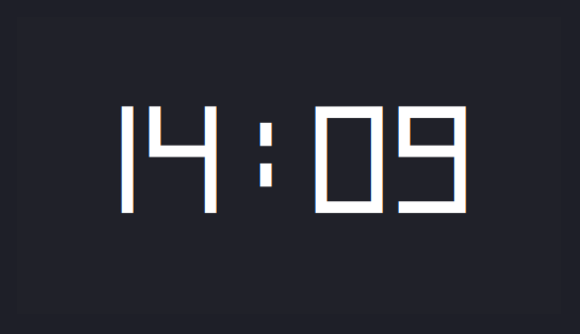
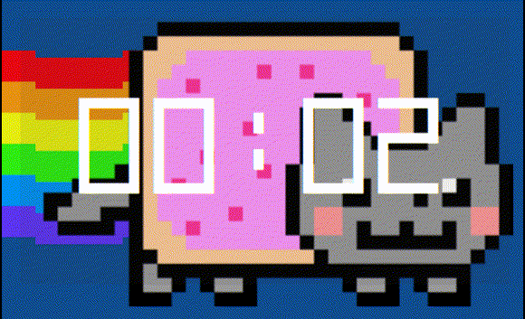

# On Screen Timer

A simple pomodoro timer where the window stay on top,
without window decoration, with semitransparent background.

# Usage

Press r to restart the timer.    
Consult your window manager on how to move a window (without the title bar).

This application doesn't loaded the font,
`assets/BlockDigits.ttf` needed to be installed as system font.

